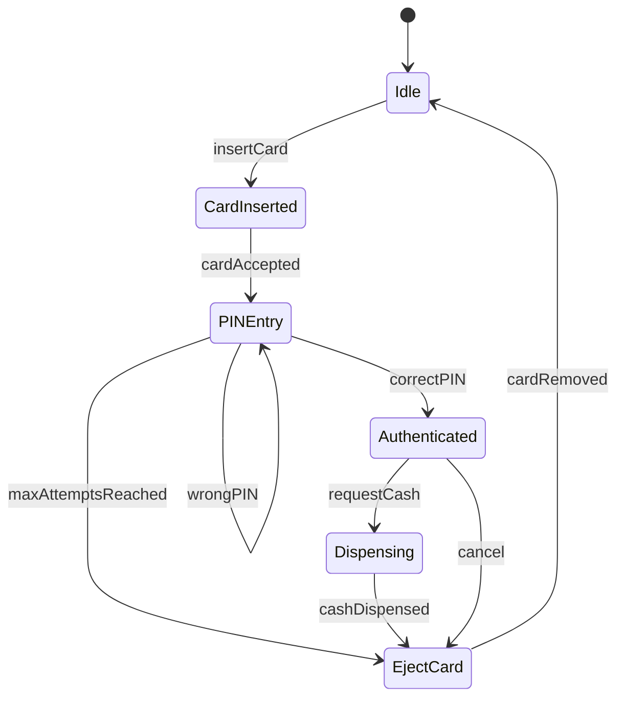

# ATM State Machine

This diagram models the states of an Automated Teller Machine (ATM). The machine begins idle, accepts a card, prompts for a PIN (retrying on wrong entry), authenticates the user, dispenses cash, and ejects the card before returning to idle.

