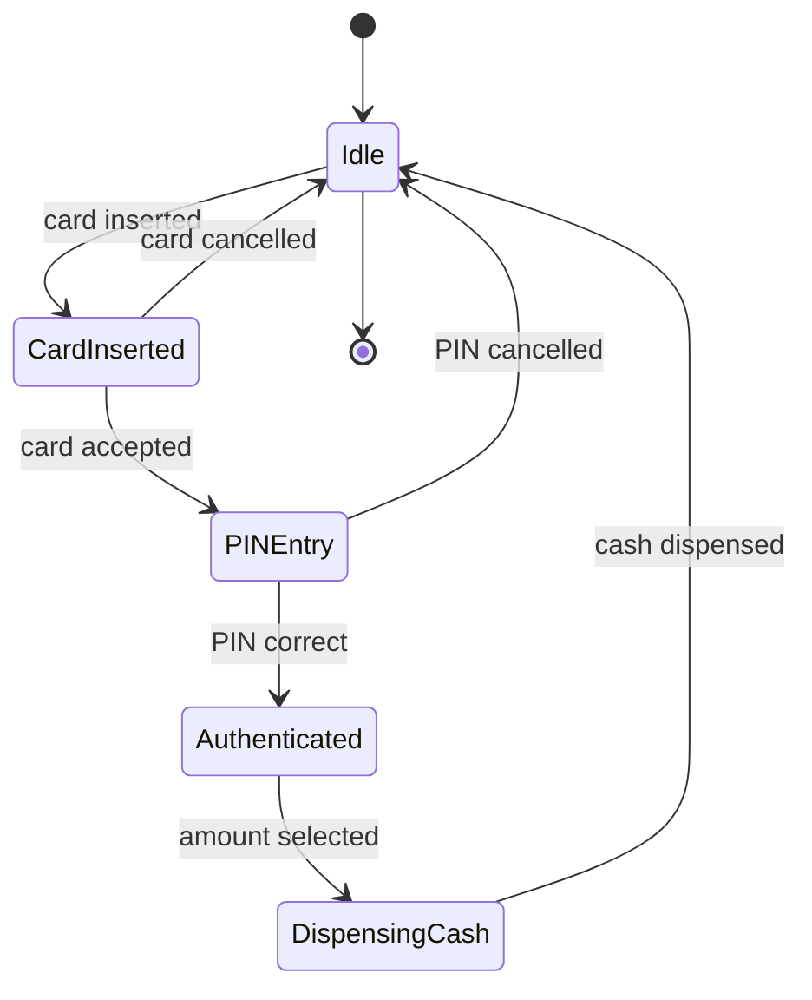

# ATM State Machine

A simple ATM flow where the machine waits idle, accepts a card, prompts for a PIN, authenticates the user, and dispenses cash before returning to idle.

```mermaid
stateDiagram-v2
    [*] --> Idle
    Idle --> CardInserted : card inserted
    CardInserted --> PINEntry : card accepted
    CardInserted --> Idle : card cancelled
    PINEntry --> Authenticated : PIN correct
    PINEntry --> Idle : PIN cancelled
    Authenticated --> DispensingCash : amount selected
    DispensingCash --> Idle : cash dispensed
    Idle --> [*]
```
