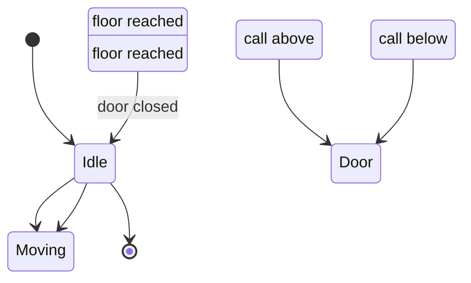

# Elevator State Machine

A simple elevator operating cycle where the car idles at a floor, moves up or down in response to a call, and returns to idle once the destination floor is reached.

```mermaid
stateDiagram-v2
    [*] --> Idle
    Idle --> Moving Up : call above
    Idle --> Moving Down : call below
    Moving Up --> Door Open : floor reached
    Moving Down --> Door Open : floor reached
    Door Open --> Idle : door closed
    Idle --> [*]
```
