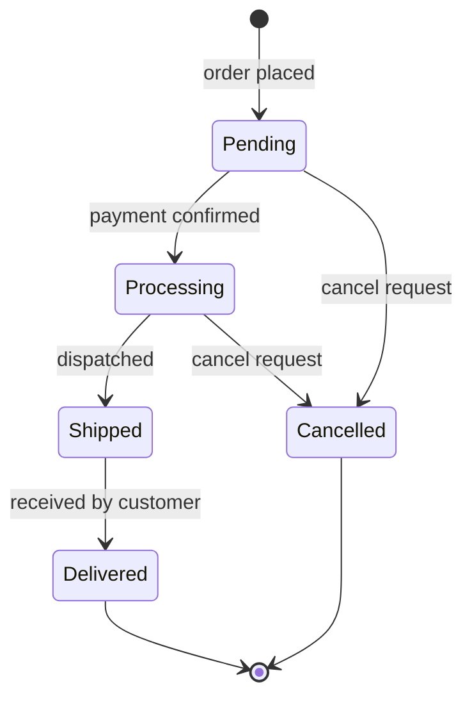

# Order Lifecycle State Machine

A business-domain state machine showing how an order moves from placement through to delivery, with a cancellation path available before shipment.

```mermaid
stateDiagram-v2
    [*] --> Pending : order placed
    Pending --> Processing : payment confirmed
    Pending --> Cancelled : cancel request
    Processing --> Shipped : dispatched
    Processing --> Cancelled : cancel request
    Shipped --> Delivered : received by customer
    Delivered --> [*]
    Cancelled --> [*]
```
