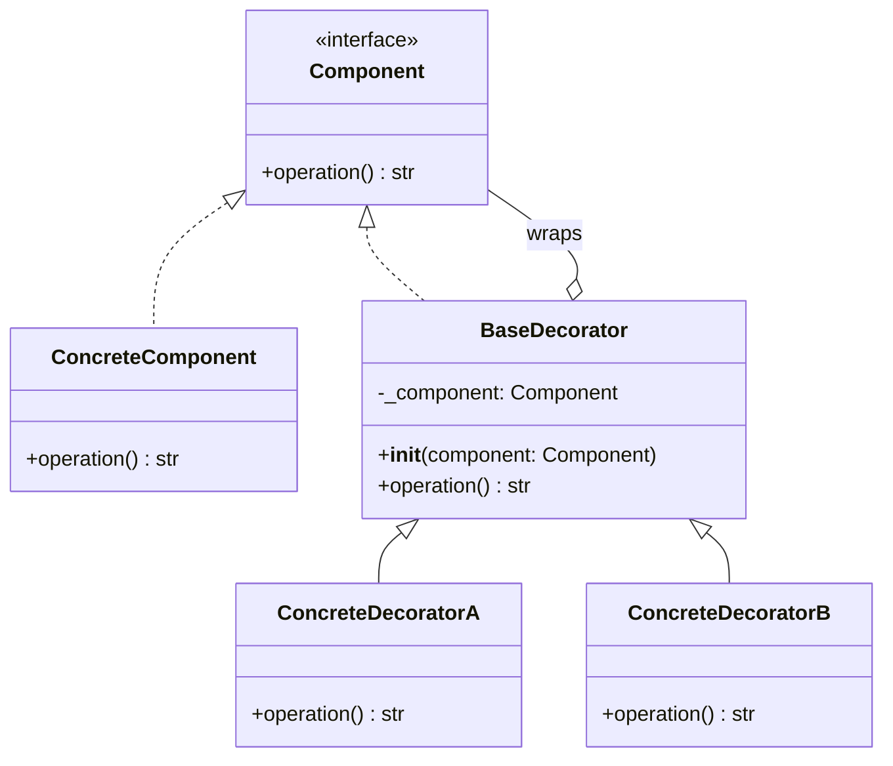

# Decorator Pattern — A Structural Design Pattern

The Decorator pattern attaches additional responsibilities to an object dynamically,
providing a flexible alternative to subclassing for extending functionality.

---

## Overview

The Decorator pattern is a **structural** design pattern from the Gang of Four (GoF)
catalog. It addresses a common limitation of inheritance: to add behaviour to individual
objects rather than an entire class, or to combine multiple optional behaviours without
an explosion of subclasses.

Instead of subclassing, the Decorator wraps the target object in a series of decorator
objects. Each decorator implements the same interface as the component it wraps, so it
is transparent to the caller. The decorator delegates the core work to the wrapped
component, adding its own behaviour before or after the call.

Python has language-level decorator syntax (`@decorator`) which is related but not
identical to the GoF Decorator pattern. The GoF pattern operates on *objects* at runtime,
while Python's `@` syntax operates on *functions or classes* at definition time. Both
share the wrapping concept; the GoF version is the generalisation.

---

## Structure



The pattern involves four participants:

- **Component** — The abstract interface shared by both the concrete component and all
  decorators. Clients program to this interface and never need to know whether they hold
  a plain component or a decorated one.

- **ConcreteComponent** — The base object that provides the core implementation. It is
  the innermost layer that decorators wrap.

- **BaseDecorator** — Holds a reference to a Component and delegates all calls to it.
  Subclasses override the delegating methods to add their own behaviour.

- **ConcreteDecorator** — A specific decorator that adds one piece of extra behaviour.
  Multiple concrete decorators can be stacked in any order.

---

## When to Use

- **I/O stream pipelines** — When reading or writing data, behaviours such as buffering,
  compression, encryption, and logging each represent an independent concern. Java's
  `InputStream` hierarchy (`BufferedInputStream`, `GZIPInputStream`) is a classic example
  of this pattern in a standard library.

- **HTTP middleware chains** — When a web request passes through a sequence of concerns
  (authentication, rate-limiting, caching, logging), each middleware wraps the next
  handler. WSGI middleware in Python (e.g., wrapping a Django app with a `ProxyFix` or
  `SessionMiddleware`) uses this structure.

- **Optional UI rendering enhancements** — When a text rendering component needs optional
  features such as scroll bars, borders, or shadows, decorators can add each feature
  independently and in any combination without requiring a subclass for every permutation.

- **Feature toggles on service objects** — When an application service needs optional
  cross-cutting behaviour (audit logging, caching, retries) that should be applied in
  production but omitted in tests or local development. Each concern becomes a decorator
  that can be toggled without touching the core service.

---

## Trade-offs

### Advantages

- **Open/Closed Principle** — New behaviours can be added as new decorator classes
  without modifying the ConcreteComponent or existing decorators. The system is open
  for extension and closed for modification.

- **Single Responsibility Principle** — Each decorator handles exactly one concern.
  Responsibilities are cleanly separated rather than bundled into a large class or a
  deep inheritance hierarchy.

- **Flexible composition at runtime** — Decorators can be stacked in any order and any
  combination at runtime, enabling fine-grained control over behaviour without committing
  to a fixed class hierarchy at compile time.

- **Avoids class explosion** — Without the Decorator pattern, combining N optional
  features via inheritance would require 2ᴺ subclasses. Decorators reduce this to N
  decorator classes that compose linearly.

### Disadvantages

- **Many small objects** — Heavy use of decorators produces a large number of
  wrapper objects that are hard to inspect and debug. Stack traces can be difficult to
  follow when calls tunnel through many layers.

- **Order sensitivity** — The behaviour of a decorator stack depends on the order in
  which decorators are applied. Incorrect ordering can produce subtle bugs that are hard
  to identify.

- **Interface coupling** — All decorators must implement the same interface as the
  component. If the interface is large, every decorator must provide a pass-through
  implementation for every method it does not override, adding boilerplate.

---

## Code Example

The following Python example demonstrates the Decorator pattern applied to a text
rendering pipeline. A `TextRenderer` is the core component; `BoldDecorator`,
`ItalicDecorator`, and `PrefixDecorator` each add a formatting concern independently.

```python
from abc import ABC, abstractmethod


class TextComponent(ABC):
    """Component interface shared by the concrete component and all decorators."""

    @abstractmethod
    def render(self) -> str:
        pass


class PlainText(TextComponent):
    """ConcreteComponent — the base text with no decoration."""

    def __init__(self, text: str) -> None:
        self._text = text

    def render(self) -> str:
        return self._text


class TextDecorator(TextComponent):
    """BaseDecorator — delegates to the wrapped component."""

    def __init__(self, component: TextComponent) -> None:
        self._component = component

    def render(self) -> str:
        return self._component.render()


class BoldDecorator(TextDecorator):
    """ConcreteDecorator — wraps output in Markdown bold markers."""

    def render(self) -> str:
        return f"**{self._component.render()}**"


class ItalicDecorator(TextDecorator):
    """ConcreteDecorator — wraps output in Markdown italic markers."""

    def render(self) -> str:
        return f"_{self._component.render()}_"


class PrefixDecorator(TextDecorator):
    """ConcreteDecorator — prepends a custom prefix string."""

    def __init__(self, component: TextComponent, prefix: str) -> None:
        super().__init__(component)
        self._prefix = prefix

    def render(self) -> str:
        return f"{self._prefix}{self._component.render()}"


if __name__ == "__main__":
    base = PlainText("Hello, World")

    bold = BoldDecorator(base)
    print(bold.render())  # **Hello, World**

    bold_italic = ItalicDecorator(BoldDecorator(base))
    print(bold_italic.render())  # _**Hello, World**_

    prefixed_bold = PrefixDecorator(BoldDecorator(base), prefix="NOTE: ")
    print(prefixed_bold.render())  # NOTE: **Hello, World**
```

---

## Related Patterns

- **Composite** — Both Composite and Decorator rely on recursive composition. Composite
  builds tree structures of uniform components; Decorator adds behaviour to a single
  component at a time. They can be combined: a Composite node can itself be decorated.

- **Strategy** — Strategy changes an object's *algorithm* by swapping out an internal
  object; Decorator changes an object's *interface behaviour* by wrapping it. Use
  Strategy when the core algorithm varies; use Decorator when cross-cutting concerns
  need to be layered on.

- **Proxy** — Both Proxy and Decorator wrap an object and implement the same interface.
  The intent differs: a Proxy controls access to an object (e.g., lazy loading, access
  control), whereas a Decorator extends or modifies behaviour. The structural difference
  is often negligible.
