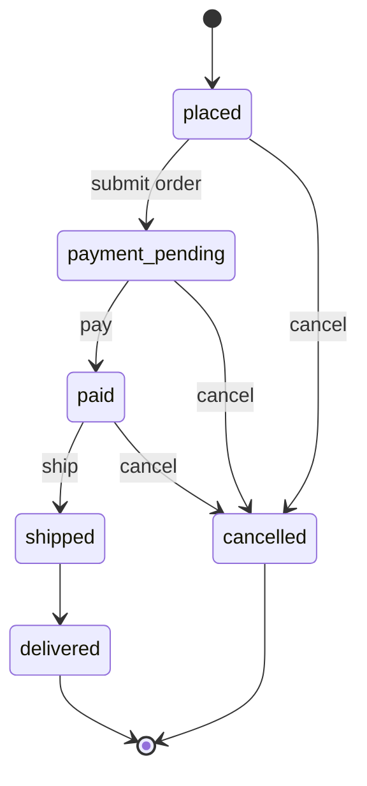

# Order Fulfillment State Machine

This diagram models the lifecycle of an e-commerce order, from placement through delivery, including a cancellation path available at multiple stages.

```mermaid
stateDiagram-v2
    [*] --> placed
    placed --> payment_pending : submit order
    placed --> cancelled : cancel
    payment_pending --> paid : pay
    payment_pending --> cancelled : cancel
    paid --> shipped : ship
    paid --> cancelled : cancel
    shipped --> delivered
    delivered --> [*]
    cancelled --> [*]
```
