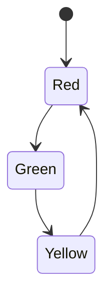

# Traffic Light State Machine

A traffic light cycles through three states in a fixed sequence: Red stops traffic, Green allows it, and Yellow signals the upcoming stop.

```mermaid
stateDiagram-v2
    [*] --> Red
    Red --> Green
    Green --> Yellow
    Yellow --> Red
```
