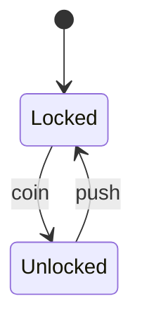

# Turnstile State Machine

A classic two-state machine illustrating a turnstile that starts locked and unlocks when a coin is inserted, then re-locks when pushed through.

```mermaid
stateDiagram-v2
    [*] --> Locked
    Locked --> Unlocked : coin
    Unlocked --> Locked : push
```
