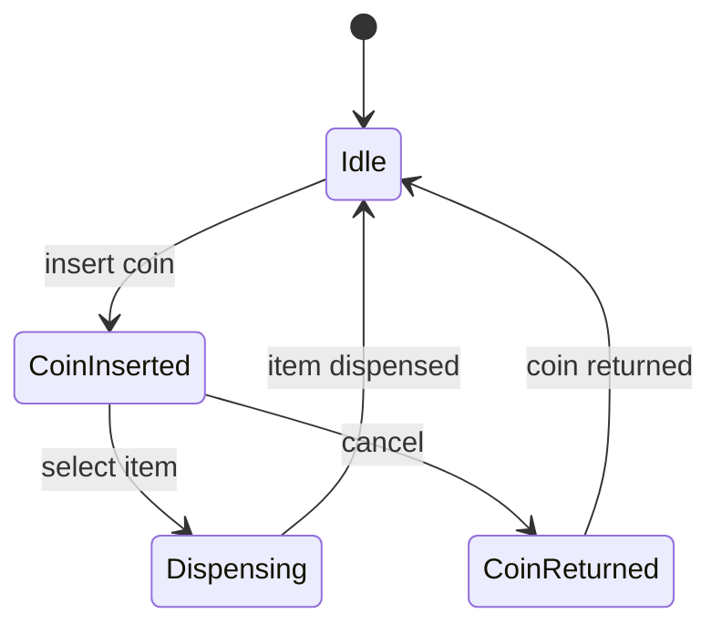

# Vending Machine State Machine

A simple state machine illustrating the flow of a vending machine from idle through coin insertion, item selection, and dispensing.

```mermaid
stateDiagram-v2
    [*] --> Idle
    Idle --> CoinInserted : insert coin
    CoinInserted --> Dispensing : select item
    CoinInserted --> CoinReturned : cancel
    Dispensing --> Idle : item dispensed
    CoinReturned --> Idle : coin returned
```
