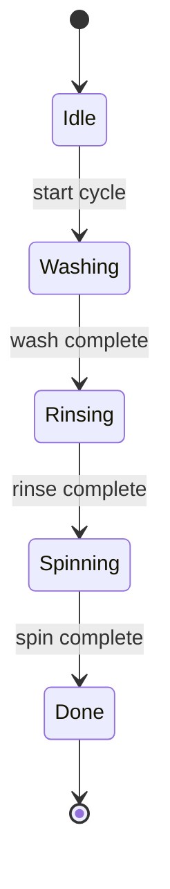

# Washing Machine State Machine

A simple washing machine cycle where the drum starts idle, progresses through washing, rinsing, and spinning stages, then signals that the cycle is done.

```mermaid
stateDiagram-v2
    [*] --> Idle
    Idle --> Washing : start cycle
    Washing --> Rinsing : wash complete
    Rinsing --> Spinning : rinse complete
    Spinning --> Done : spin complete
    Done --> [*]
```
